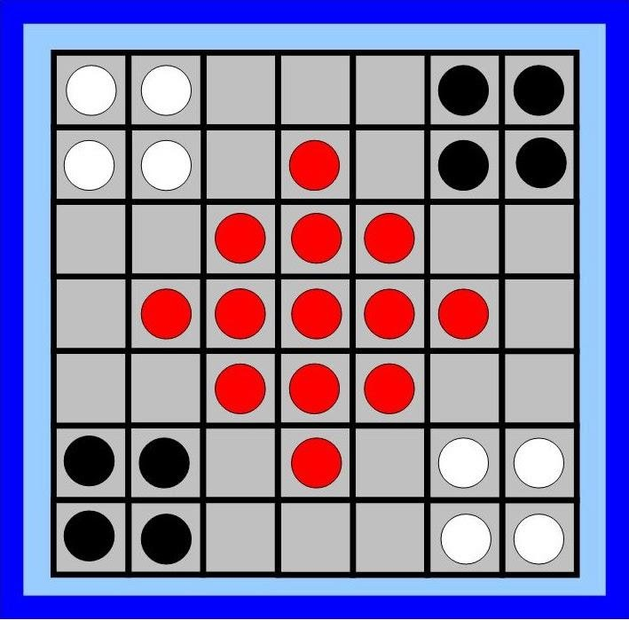

# KubaBoardGame

An object-oriented implementation of the board game Kuba, created as a portfolio project for the course CS162 at Oregon State University.

A copy of the game rules is available [here](https://sites.google.com/site/boardandpieces/list-of-games/kuba). A video demonstration of game rules is available [here](https://www.youtube.com/watch?v=XglqkfzsXYc).

The project consists of a KubaPlayer class and a KubaGame class, detailed as follows.


## KubaPlayer Class

The player class holds the player's name, the player's color, the number of red marbles captured by the player, the number of marbles of the opponent's color that the player has captured, and methods to increase the number of red marbles and opponent's marbles held by the player.

## KubaGame Class

The game class takes in two tuples, each of which contains a player's name and color. The class creates two player objects and stores them in a hashmap. The class also holds information of the winning player, the player whose turn it is currently, the game board, the number of red/white/black marbles on the board, as well as some temporary board states that determine whether a move made by a player is illegal.

The board contains a make_move function that takes in a playername, coordinates (given in the form row, column), and a direction of movement (left, right, forward, backward). When make_move is called, the function determines whether the given move is legal. Illegal moves include moving an opponent's marble, moving one's own marble in a direction when there isn't an empty space on the other side of the marble, and making a move that will "revert" the opponent's last move. Implementation of the revert utilizes the python copy module. The board class updates all of its attributes with each successful make_move command. The user can keep making moves until a winner has emerged between the two players.

### Sample test
```
game = KubaGame(('PlayerA', 'W'), ('PlayerB', 'B'))
print(game.get_marble_count())  # prints (8,8,13))
print(game.get_captured('PlayerA'))  # prints 0
game.make_move('PlayerA', (6, 5), 'F')
print(game.get_current_turn())  # prints 'PlayerB' because PlayerA has just played.
print(game.get_winner())  # prints None
print(game.make_move('PlayerA', (6, 5), 'L'))  # Cannot make this move, prints False
print(game.get_marble((5, 5)))  # prints 'W'
print(game.get_current_turn()) # prints 'PlayerB' because PlayerA is the last player to play.
```


  
  [image source](https://sites.google.com/site/boardandpieces/list-of-games/kuba)
